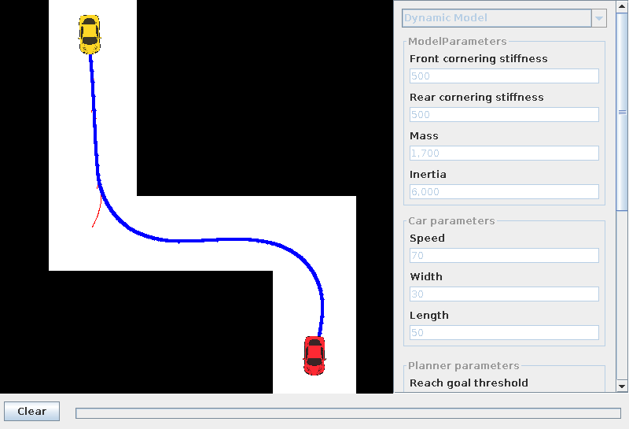

# RRT Control


This application was developed as a project for the RBE-502 course at the [Worcester Polytechnic Institute].

It is a Java implementation of the method proposed by Romain Pepy, Alain Lambert and Hugues Mounier in the paper [Path Planning using a Dynamic Vehicle Model]. It uses Rapidly-Exploring Random Trees (RRT) with a dynamic model of a car known as *bicycle model* to generate more realistic paths for a non-holonomic car-like robot. Differential equations are integrated using a Runge-Kutta method and collision checking is done using the Separating Axis Theorem.

This application includes a GUI that lets you draw obstacles and set the start and end positions of the car, as well as the parameters of the algorithm and the vehicle model.

## Using the application

### Building
The application can be built by Maven. The command

```
mvn package
```

will build an executable jar that can be run with

```
java -jar <name-of-the-jar>
```

### Binaries
You can also download the precompiled binaries at the [Releases] page.

### Usage
The interface of the application is very simple. The yellow car is the starting position. The red car is the goal position. Use the **left mouse button** to create obstacles and to move the existing ones and the start and goal positions. Use the **right mouse button** to rotate obstacles and the start and goal positions. Use the **middle mouse button** to delete obstacles.

You can save and load your settings using the **Load** and **Save** buttons. A sample configuration file comes with the application. Configuration files are generated using Java serialization and should not be modified by hand.

The panel on the right can be used to set the parameters of the algorithm. There is **no** validation of those parameters, so make sure you provide valid values for a higher chance of getting a reasonable result back. Here is a short description of each parameter:

**Car parameters:**
* **Speed:** how fast the car moves forward
* **Width and Length:** the dimensions of the car

**Planner parameters:**
* **Reach goal threshold:** threshold that determines when a certain position is considered to be the goal. Smaller values make the algorithm take longer to finish (or not finish at all) and higher values give a final state that is not very close to the desired goal.
* **Time increment:** time step used for integration. Smaller values give a more precise output, but take longer. You probably should not use values bigger than 0.2. For higher speeds, use even smaller values.
* **Max. iterations:** maximum number of iterations of the algorithm, before it gives up.
* **Min. steering angle:** minimum steering angle the algorithm will try to use. Probably something around -60 should be ok.
* **Max. steering angle:** the maximum steering angle. Values around 60 should be ok.
* **Try goal probability:** goal bias of the RRT. It is the probability of the algorithm trying to move directly to the goal. Smaller values make the algorithm explore a wider area quickly and higher values make it move faster to the goal, however, if this value is too high and there are obstacles on the way, it may never find a path around the obstacles. It is a probability, so it should always be between 0 and 1.
* **Random seed:** seed for the pseudo-random number generator. When set to zero, it uses a random seed. Use other values to achieve repeatable results from the algorithm.
 
**Dynamic Model parameters:**
* **Cornering stiffness:** a constant that is related to the tire. You can specify a different value for the front and read wheels.
* **Mass:** the mass of the vehicle
* **Inertia:** the inertia of the vehicle

## Future work
This application can be improved in several ways. New models can be added easily by implementing the `CarModel` interface. Support for different variations of the RRT would also be nice, but adding it would take a little bit more time. Finally, the nearest neighbor search is a simple naive search, which makes the algorithm much slower as the tree gets bigger. Using a KD-tree for the search would probably make it handle large numbers of nodes much better.

I probably will not add any of those, but I will gladly accept pull requests with new features or bug fixes.

[Worcester Polytechnic Institute]: http://www.wpi.edu
[Path Planning using a Dynamic Vehicle Model]: http://www.cs.cmu.edu/afs/cs/Web/People/motionplanning/reading/PlanningforDynamicVeh-1.pdf
[Releases]: http://github.com/guimeira/rrtcontrol/releases
